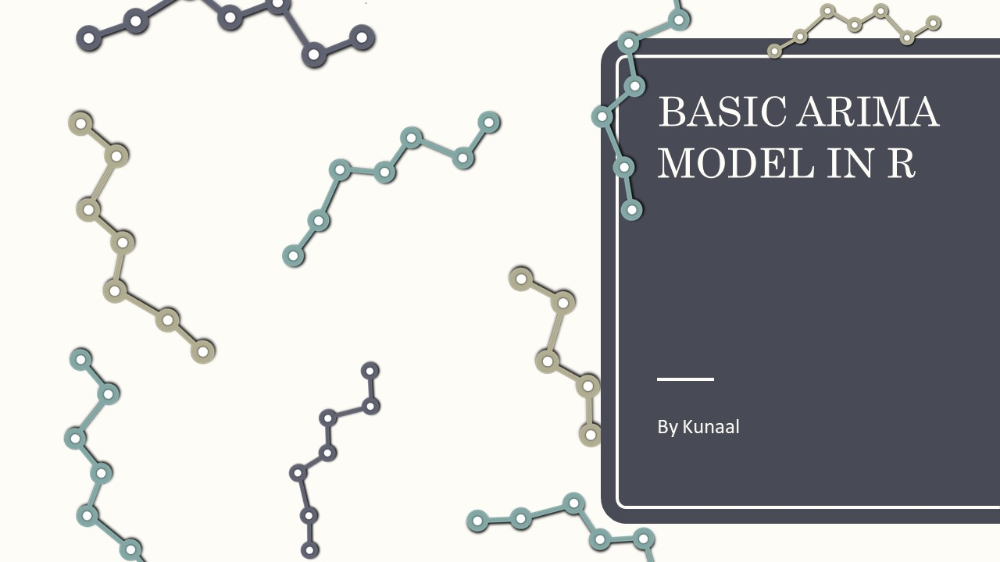
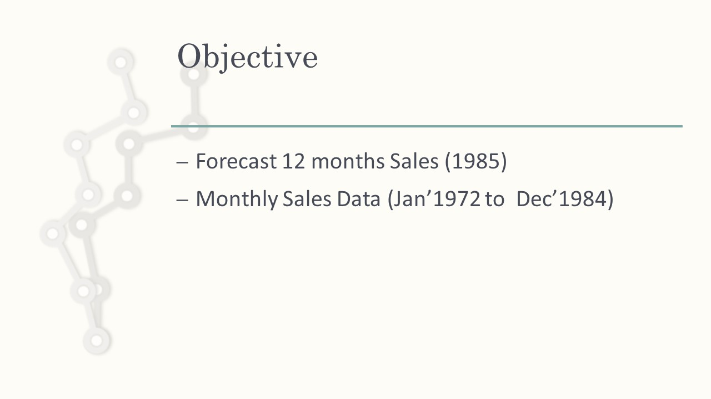
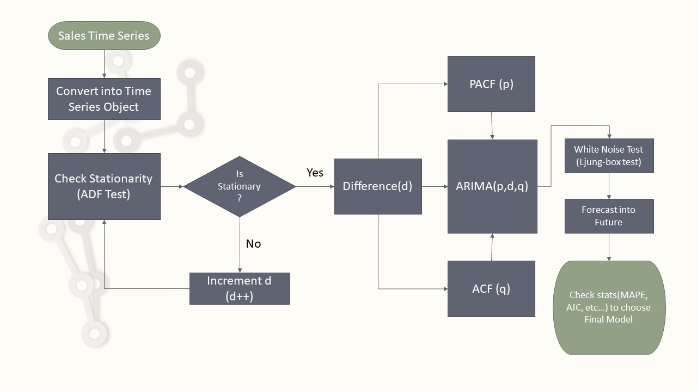
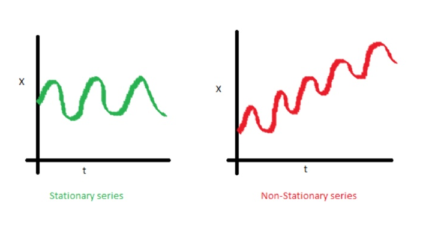

ARIMA Model In R
========================================================
author: Kunaal Naik
date: 
width: 1500
font-family: 'Arial'
transition: rotate


========================================================



========================================================


Links
========================================================

YouTube Channel - [www.youtube.com/fxexcel](http://www.youtube.com/fxexcel) 

Download Code and Data - [https://github.com/FunXExcel/YouTube-Working-Files](https://github.com/FunXExcel/YouTube-Working-Files)

Import Libraries
========================================================


```r
library(forecast)
library(tseries)
```

Change Working Directory
========================================================

Change the Directory to the location of the dataset


```r
setwd("C:\\Users\\DELL\\Documents\\__Fun_X_Excel_Channel_Videos\\Arima\\R")
```

Read Sales Dataset
========================================================


```r
sales <- read.csv("sales.csv")
```


ARIMA Model in R Process
========================================================


ARIMA Model in R Process
========================================================


Change Sales trend to Time Series
========================================================

The series is monthly. Hence, we use frequency as 12


```r
sales_ts <- ts(sales$Sales_k,start=c(1972),frequency=12)
```

Plot Sales Time series
========================================================

We will use autoplot (forecast library)


```r
autoplot(sales_ts)
```


Check Stationarity
========================================================

**Stationarity** : A stationary process has a mean and variance that do not change overtime and the process does not have trend.



Perform ADF Test
========================================================

~~Null Hypothesis - Non Stationary (Do **NOT** Reject if p value > significance level {1%} )~~

Since p is not greater significance level, the Series is **NON Stationary**


```r
adf.test(sales_ts, k = 12)
```

```

	Augmented Dickey-Fuller Test

data:  sales_ts
Dickey-Fuller = -2.3266, Lag order = 12, p-value = 0.4402
alternative hypothesis: stationary
```

Perform ADF Test on First Difference
========================================================

First Level Difference is **NON Stationary**


```r
sales_ts_d1 <- diff(sales_ts, differences = 1)
adf.test(sales_ts_d1, k = 12)
```

```

	Augmented Dickey-Fuller Test

data:  sales_ts_d1
Dickey-Fuller = -2.7588, Lag order = 12, p-value = 0.2601
alternative hypothesis: stationary
```

Perform ADF Test on Second Difference
========================================================

Since p is less than significance level, the second difference is **Stationary**

The d term in the ARIMA(p,d,q) will be **d = 2**


```r
sales_ts_d2 <- diff(sales_ts, differences = 2)
adf.test(sales_ts_d2, k = 12)
```

```

	Augmented Dickey-Fuller Test

data:  sales_ts_d2
Dickey-Fuller = -8.3478, Lag order = 12, p-value = 0.01
alternative hypothesis: stationary
```


Plot Stationary Series (d = 2)
========================================================

```r
autoplot(sales_ts_d2) 
```


Choosing p (AR or Lag) term with PACF Plot
========================================================

With the PACF plot we find that **p = 7**


```r
Pacf(sales_ts_d2)
```


Choosing q (MA or Moving Average) term with ACF Plot
========================================================

With the ACF plot we find that **q = 6**


```r
Acf(sales_ts_d2) 
```


Fitting ARIMA(7,2,6)
========================================================


```r
tsMod <- Arima(y = sales_ts,order = c(7,2,6))
```

Model Summary
========================================================


```r
print(tsMod)
```

```
Series: sales_ts 
ARIMA(7,2,6) 

Coefficients:
          ar1      ar2      ar3     ar4      ar5      ar6      ar7      ma1
      -0.4224  -0.0170  -0.2864  0.2992  -0.2722  -0.6705  -0.4064  -0.1708
s.e.   0.1336   0.0878   0.0661  0.0688   0.0964   0.1091   0.0801   0.1410
          ma2      ma3      ma4     ma5     ma6
      -0.6868  -0.1702  -0.9629  0.3210  0.6735
s.e.   0.1346   0.0563   0.0510  0.1361  0.1413

sigma^2 estimated as 256.3:  log likelihood=-651.07
AIC=1330.15   AICc=1333.17   BIC=1372.66
```

Forecast 12 periods ahead (1985)
========================================================


```r
forecast(tsMod,h=12)
```

```
         Point Forecast    Lo 80     Hi 80    Lo 95     Hi 95
Jan 1985       846.5831 825.9223  867.2438 814.9852  878.1810
Feb 1985       904.3074 868.6432  939.9716 849.7637  958.8510
Mar 1985       926.6025 881.3358  971.8691 857.3731  995.8318
Apr 1985       957.4623 907.3026 1007.6220 880.7497 1034.1749
May 1985       970.9769 920.2068 1021.7470 893.3307 1048.6230
Jun 1985       962.4589 911.6269 1013.2909 884.7181 1040.1997
Jul 1985       913.3778 861.0159  965.7398 833.2971  993.4585
Aug 1985       880.7049 824.7390  936.6707 795.1125  966.2972
Sep 1985       859.8047 800.8655  918.7440 769.6650  949.9445
Oct 1985       852.0513 792.1526  911.9499 760.4442  943.6583
Nov 1985       835.8556 775.9568  895.7544 744.2483  927.4629
Dec 1985       857.4031 796.9570  917.8491 764.9588  949.8473
```

ARIMA Model in R Process
========================================================


Plot the Final Series with Forecast
========================================================


```r
autoplot(forecast(tsMod,h=12))
```


